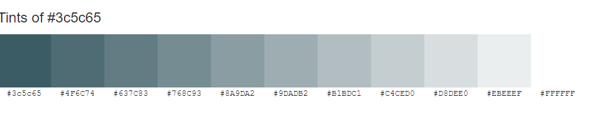

SustainLuxe

## Table of Contents

### [About](#about)

SustainLuxe has a careful selection of clothes and accessories with quality made by designers and selling Second Hand.
It should still feel luxurious and stylish to buy from this shop.

### [Research](#research) 
  Websites for research:
* https://signofthetimeslondon.com/
* https://www.climatestewards.org/offset/
* https://www.refunder.se/
* https://www.sellpy.se/
* https://us.vestiairecollective.com/
* https://static.schibsted.com/wp-content/uploads/2020/06/04123109/schibsted-adevinta-second-hand-effect-2020.pdf

### [Media](#media)
* https://stocksnap.io/
* https://www.istockphoto.com/

### [Agile method](#agile-method) 

In the beginnig of the project I made some research of other e-commerce and similar Second Hand Stores.
I also brainstormed what I want to achieve and how to plan the project.
For this project with a buisness as e-commerce, it´s important to make the app rechable, so I add SEO and marketing strategy.

#### [Concept Chart](#concept_chart)

#### [ERD](#erd)
I planned and skiss the models in Google Drive

#### [User Stories](#user-stories)
- Milestones
- EPICS
- User stories

#### [wireframes](#wireframes)  

### [Marketing-Research--SEO](#marketing-Research -- seo) 
Success search and marketing by

### [Buisness Model](#buisness_model)
The business operates on a C2C model (Consumer-to-Consumer) and revenue comes from administration fee and profit share of the selling price.
The emphasis is on the traffic to the e-commerce and it should feel more serious and luxury to buy from credible and attractive design store. Focus is also to make people consious of Sustainable choices, Climate Controll and how to make resposible of their purposes without reduce the quality.
Key features is to sell good but not used stuff easily and quisck without own commitment needed.

### [UX](#ux)
Goal to keep good UX principles regarding layout/colors/interaction
Responsive for different devices.

### [Design] (#design) 

- Logotype is created to simulate fun, but conscious and responsible shopping.  

- Font: Oswald 700

- Colors: 
  Logo, slogan #3c5c65
  Font #637c83
 

- Favicon

### [Features](#features) 

#### [Existing Features](#existing_featuers)

-Navbar
-Registration/Log in Page
-Profile Page
-Shopping page
-Category search
-Filter
-Product detail
-Shopping Bag
-Checkout 
-About us
-Customer service
-Product Management
- Footer
-Error page

#### [Future Features](#future_features)

### [Marketing](#marketing)

-Facebook
-Newsletter
-TikTok

### [Technologies Used](#technologies_used)

* GitHub
* GitPod
* Stripe

#### Languages:
-HTML
-CSS
-Python
-JS

#### Frameworks and libraries:
-Django
-MBD (Bootstrap)
-Psycopg2: the database driver used to connect to the database.
-Django-allauth: the authentication library used to create the user accounts.
-Django-crispy-forms: was used to control the rendering behavior of Django forms.
- Mailchimp

#### Databases:
SQLite: was used as a development database.
PostgreSQL: the database used to store all the data.
AWS Web Services

### [Testing](#testing)

#### [Validators](#validators)

- W3C Validator: was used to validate HTML5 code for the website.
Result:

- W3C CSS validator: was used to validate CSS code for the website.
Result:
- JShint: was used to validate JS code for the website.
Result:
- PEP8: was used to validate Python code for the
Result:

#### [Responsiveness](#responsiveness)

#### [Lighthouse](#lighthouse)

#### [Manual Testing](#manual_testing) 

### [Bug Report](#bugreport)

### [Deployment](#deployment) 

SustaineLuxe is host on GitHub and deployed on Heroku

### [Credits](#credits)

* https://app.logomaster.ai/ - help making a logotype
* https://www.colorhexa.com/ - Colorscheme
* https://climatepartnerimpact.com/get-involved/ - derivation to a project for donation
* http://lucid.app - Creating a concept Plan
* https://fontawesome.com/ -font awesome icons
* https://www.istockphoto.com/ -pictures
* https://pypi.org/project/psycopg2/ -tutoring psycopg2

* 
### [Acknowledgements](#acknowledgements)

- Tutoring, Q&A and criteria videos in slack channel project-potfolio-5-e-commerce
- Inapiration from others PP5 projects
- walk through Boutique Ado
- https://www.youtube.com/watch?v=hZYWtK2k1P8 -tutoring stripe payment

- https://www.bigcommerce.com/articles/ecommerce/fashion-ecommerce/
- https://python.plainenglish.io/creating-a-django-e-commerce-product-filter-prototype-a8e7409453fc -creating filter tutoring
- https://stackoverflow.com/ - -creating filter tutoring
- https://dev.to/earthcomfy/django-user-profile-3hik -profile tutoring
- https://www.paleblueapps.com/rockandnull/django-user-profile/
- https://docs.djangoproject.com/en/5.1/howto/custom-management-commands/ - tutoring create accounts
- https://simpleisbetterthancomplex.com/tutorial/2018/08/27/how-to-create-custom-django-management-commands.html 
- https://www.youtube.com/watch?v=9X83BZ1cF7o - tutoring request cycle
- https://simpleisbetterthancomplex.com/tutorial/2018/08/27/how-to-create-custom-django-management-commands.html - tutoring manage commands
- https://groups.google.com/g/django-users/c/aSj3jGX2CLk -tutoring expire date
- https://stackoverflow.com/questions/49366010/how-to-set-an-expiry-date-for-an-object-in-django 

