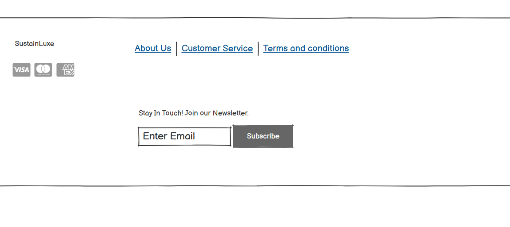
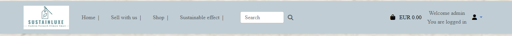
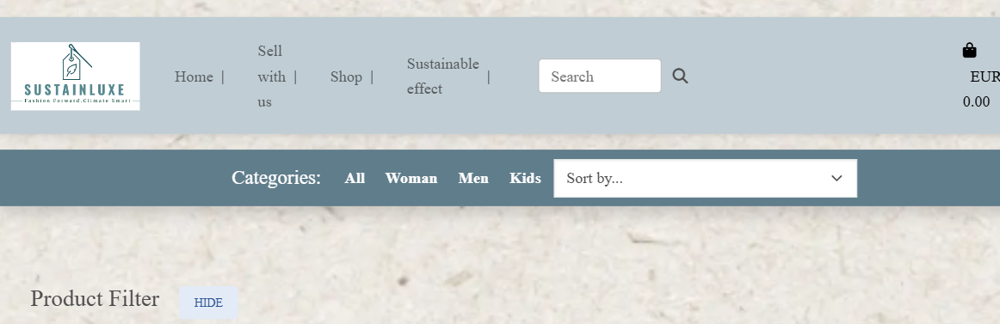

# SustainLuxe - Shop luxurios and Sustainable

## Table of Contents

- [About](#about)
- [Marketing research](#marketing-research) 
- [Agile method](#agile-method) 
  - [Concept Chart](#static/images/Readme_img/concept_chart_sustainLuxe.png)
  - [Buisness Model](#buisness_model)
  - [ERD](#erd)
  - [User Stories](#user-stories) 
- [wireframes](#wireframes)
- [UX](#ux)
- [Design](#design)
- [Media](#media)
- [Features](#features) 
  - [Existing Features](#existing_featuers)
  - 

### [About](#about)

SustainLuxe is a second Hand Shop online for designer clothes.
You find a careful selection of clothes and accessories with quality made only by designers.
Second Hand market grows fast!
The reason for increased shopping in second Hand market is because of financial reason,
but the next as much is environmental reason and it has become a trendy way of shopping.
I will keep it luxury and financial giving, while I will be part of environmental participation.
Through my shop I will be a part of saving the word, through impact people to aknowledge the Second Hand effect 
and donate a part of the revenue to an important organisation to help environmental impact.

I think a lot of people is to busy to take their time for selling unused clothes, so my idea is to make it simple to sell, buy and collect revenues.

You are welcome to visit my store and get to know more!

Live web site: https://sustainluxe-b6e840083c68.herokuapp.com/

I have thinking of this idea for some years and in the meantime, the buissness of Second Hand is growing, so I´m happy to present this fictive busisness.
This is a Full-Stack project with Django.

### [Marketing research](#marketing-research) 

I started to make research to update me of this market and to investigate the footprint and Carbon effect of shopping behaviors.
I also made a SEO research to get strong SEO keywords to use for high ranking in Google.

[You can read more of my SEO and Marketing research here](seo_marketing_research.md)

### [Agile method](#agile-method) 

After research of other e-commerce and similar Second Hand Stores, I also brainstormed what I want to achieve and how to plan the project.
I have used an agile method for this project.

#### [Concept Chart](#static/images/Readme_img/concept_chart_sustainLuxe.png)
I created de a concept chartfor my idea.

### [Buisness Model](#buisness_model)
The business operates on a C2C model (Consumer-to-Consumer) and revenue comes from administration fee and profit share of the selling price.
The emphasis is on the traffic to the e-commerce and it should feel more serious and luxury to buy from credible and attractive design store.
Focus is also to make people consious of Sustainable choices, Climate Controll and how to make resposible of their purposes without reduce the quality.
Key features is to sell used stuff easily and quick without own commitment needed.
I added a buisness process to formulate the different modules I will work on

I used Lucid chart to my concept chart and buisness model.

#### [ERD](#erd)
I planned and skiss the models in [Google Drive ](https://drive.google.com/file/d/1SYwaMzGs6PuOuEuA6Yi4T2Q0p8dvmSvd/view?usp=sharing)
There are different modules since the product is for both selling and buying.
It got mixed up between Products app and Profiles app, since I had Product model in both but in different use.
Then I changed Product model in Profiles app to Sale model to separate them.

#### [User Stories](#user-stories)
I set up a project in Github with a canban. Link to canband: https://github.com/users/Christina5P/projects/8/views/1?layout=board
This project is divided into:
- Milestones

  - EPICS

  In every milestone, there is divided in EPICS, for ex.
  

    - User stories

    In EPICS, it is divided to USERSTORIES, for ex.
 
  

      - Tasks
      There could also be some tasks.

### [wireframes](#wireframes)  

The Wireframe were created using https://balsamiq.cloud

Wireframes

Homepage:

Navbar:

Footer:

Products:

!

Sign In:

### [UX](#ux)

My goal is to keep good UX principles regarding interaction/layout/colors/
 
* Users needs
In my webshop, I have designed a clear and attention-grabbing headline to guide users and emphasize that it is a second-hand marketplace focused on promoting future sustainability. 
Both buyers and sellers are welcomed, with the site divided into well-defined sections to facilitate easy navigation and support specific purposes.

* Sell with Us
I chose the headline to foster an inviting sense of engagement. 
Visually, the selling process is broken down into a flow with accompanying images to minimize lengthy text that could cause users to lose interest.
The flow includes clear headings and illustrative images, supplemented with an information icon for additional details.
For those interested in selling items, there is a direct link to the submission form.

* Shop
The headline clearly indicates what to expect—shopping! In the shop,
users can easily find specific items through various tools such as category selection, sorting, and filtering options.
I have also included a free-text search function. Buyers only see available items, and clicking on a product reveals detailed information such as brand, size, and condition. Additionally, I display data on CO2 savings associated with purchasing the item to encourage environmentally motivated buying behavior. 
Adding items to the cart is straightforward, as is removing items, continuing shopping, or proceeding to checkout.
Clear information about free shipping is provided to boost sales.

* The footer includes details on accepted credit cards to save users from searching for this information and to speed up their decision-making process.
You can also find navigation to information and further service where to expect it.

* Navigation Bar
The navigation bar features a spacious layout for visual balance, with a logo that embodies sustainability and luxury through a neutral font and descriptive design.

* Profile Menu
I created an easy-to-navigate profile menu with descriptive icons beside text options, tailored to the user's status (e.g., logged-in user or administrator), ensuring clear and frustration-free navigation.
The menu is purposefully structured to prevent clutter and maintain organization.

* Background and Visuals
I selected a background that resonates with an eco-friendly theme, reinforcing the sustainability message.
The color scheme of the text and navigation bar is carefully chosen to complement the site’s elegant style, aligning with the high-quality product range.

* Responsiveness
On smaller screens, the menu switches to a toggle format for a cleaner user experience.
Images and products are arranged vertically for seamless scrolling. Additionally, the shop includes a “back to top” navigation arrow to quickly return to the menu.

###  [Design](#design) 

To design this website I proceeded from luxurury and sustainable thinking.
I want the user to realize that you can combinate this two foundations and that sustainable is for everyone.

- Logotype is created to simulate fun, but conscious and responsible shopping.  
  It includes a needle to visualize it is about clothes.

  

- Colors: 
  Logo and slogan have color #3c5c65
  Font #637c83
  I use colors from a palette to harmonize together.
  They are calm, but heading to green/blue scale to visualize luxurize and nature.
      
 

- Favicon
I use the same image for favicon and "no img" to show sustainable and clothes
I also load the favicon to work on different devices

Background is by recycled paper to give the touch to sustainable.

- Font
 Playfair Display SC

 The font is simple to read and have a luxury touch, which is important for user to understand the class of selling clothes.
 It showing seriously sell and buy.
 I have the same font across the pages to make it consistent.

 

### [Media](#media)

Image and content used from media:

* https://stocksnap.io/
* https://www.istockphoto.com/
* https://www.alamy.com/stock-photo
* https://clossue.com/eu/blog
* http://almonds.ai  
* https://urbanswall.com/luuxly-com-your-destination-for-luxury-fashion-and-lifestyle/
* https://www.lifestyleasia.com/ind/style/fashion/second-hand-luxury-is-the-new-sustainable-trend/
* https://us.vestiairecollective.com/ - I have borrowed product img from this second hand store
* https://app.logomaster.ai/ - help making a logotype
* https://www.colorhexa.com/ - Colorscheme
* https://climatepartnerimpact.com/get-involved/ - derivation to a project for donation
* http://lucid.app - Creating a concept Plan
* https://fontawesome.com/ -font awesome icons
* https://www.istockphoto.com/ -pictures

## [Features](#features) 

### [Existing Features](#existing_featuers)

Navbar

Visible for all users.
Navigate users to different sections for sell, buy and read more about Sustainable effect. 
Clear view if you are logged in or not.
Menu for profile.
You view different choice if you are logged in or not.

If you go to shop you view an extended navbar that also includes shopping bag and search field.

Registration / Log In

Log In page with a navigator back to homepage.

Sign Up page with navigator back to Log in

If you click Forgot password:

Sign Out page

Profile Page

When you are logged in you will reach your profile and account from a dropdown menu for easy navigation.

Sellers Products for sale

As a user, you fill in the form to sell a product and submit. 

You have a checkbox if you want to pay for return of unsold product, so admin can monitor reutrns from database.

After that you get a sale confirmation with information how to proceed.
 

The user can now follow the product in account detail

Shopping page

#### Category / search

There is a navbar with the categories, where you can choose from

You can also sort from diffrent choices

#### Filter

If you like to filter from multiple choices, you can use the filter form

#### Product details

Click on an img to get product detail as brand, size, condition and carbon saving

User can add multiple img to the product:

#### Shopping Bag

User can click on shoppingbag in menu to see bags content and any delivery costs.

There is a possible to remove products, keep shopping or go to checkout

#### Checkout 

You click on checkout and make your payment

After process, you get a confirmation

Admin

As an admin, you pick up the product in database, complete the information anf image and list it in shop.

Footer

Error page

#### [Future Features](#future_features)

* change visual layout of  multiple img  to be clickable and navigation buttons

### [CRUD](#crud)

-Create
User can create a selling order, and create an order in shop
Authorized users can create a withdrawal request.
Superuser can add an product in Product Management view.

-Read 
Users van view homepage, sell page, sustainpage and shop.
Authorized users can view order history, products for sale, withdrawal history

-Update
Authorized users can update profil settings
Superuser can update product info. 

-Delete
Users can delete products in shoppingbag 
Superuser can delete product from Product Management view.

### [Technologies Used](#technologies_used)

#### Platforms
* GitHub - Web-based platform to manage repository and collaboration tool.
* Stripe - Payment processing platform

#### IDE
* GitPod

#### Languages:
* HTML
* CSS
* Python
* JS

#### Frameworks and libraries:
* Django
* MBD (Bootstrap5)
* Psycopg2: the database driver used to connect to the database.
* Django-allauth: the authentication library used to create the user accounts.
* Django-crispy-forms: was used to control the rendering behavior of Django forms.
* Django-filter- for adding filter capabilities
* Django- countries - Liberary for handling country fields
* dj-stripe - integrationg stripe payment
* gunicorn- used for deploying
* jmespath - for querying JSON data structures
* pillow - libarery for img processing
* pytz - liberary for handöing timezones  
* Mailchimp

#### Databases:
* SQLite: was used as a development database.
* PostgreSQL: the database used to store all the data.
* AWS Web Services: service used to store media and static files

### [Setup](#setup)

Read about setups in this document:

[Read Document](setups.md)

### [Deployment](#deployment) 

Read about setups in this document:

[Read Document](deployment.md)

### [Testing](#testing)

#### [Validators](#validators)

- W3C Validator: was used to validate HTML5 code for the website.
Result:

- W3C CSS validator: was used to validate CSS code for the website.
Result:
- JShint: was used to validate JS code for the website.
Result:
- PEP8: was used to validate Python code for the
Result:

#### [Responsiveness](#responsiveness)

#### [Lighthouse](#lighthouse)

#### [Manual Testing](#manual_testing) 

I need to test continously and before submitting the project I made manual testing of the project.
I had a separate test dokumnent for reporting
Link to my test dokument: https://docs.google.com/document/d/1LPkE_CAtZQuE4urXtBMwkbCD7vIR0EaKDLfl37nrFYM/edit?usp=sharing

### [Bug Report](#bugreport)

I created a separate bug report.
You can read the report with this link: https://docs.google.com/document/d/1Q_QkhXgTo5Ocxd-jRNPWcHfwuIycwIpS62rIy_T5-KQ/edit?usp=sharing

* 
### [Acknowledgements](#acknowledgements)

- Tutoring, Q&A and criteria videos in slack channel project-potfolio-5-e-commerce
- Inapiration from others PP5 projects
- walk through Boutique Ado
- https://www.youtube.com/watch?v=hZYWtK2k1P8 -tutoring stripe payment
- https://docs.github.com/en/get-started/writing-on-github/getting-started-with-writing-and-formatting-on-github/basic-writing-and-formatting-syntax
- https://pypi.org/project/psycopg2/ -tutoring psycopg2
- https://www.bigcommerce.com/articles/ecommerce/fashion-ecommerce/
- https://python.plainenglish.io/creating-a-django-e-commerce-product-filter-prototype-a8e7409453fc -creating filter tutoring
- https://stackoverflow.com/ - -creating filter tutoring
- https://dev.to/earthcomfy/django-user-profile-3hik -profile tutoring
- https://www.paleblueapps.com/rockandnull/django-user-profile/
- https://docs.djangoproject.com/en/5.1/howto/custom-management-commands/ - tutoring create accounts
- https://simpleisbetterthancomplex.com/tutorial/2018/08/27/how-to-create-custom-django-management-commands.html 
- https://www.youtube.com/watch?v=9X83BZ1cF7o - tutoring request cycle
- https://simpleisbetterthancomplex.com/tutorial/2018/08/27/how-to-create-custom-django-management-commands.html - tutoring manage commands
- https://groups.google.com/g/django-users/c/aSj3jGX2CLk -tutoring expire date
- https://stackoverflow.com/questions/49366010/how-to-set-an-expiry-date-for-an-object-in-django 
- https://django-simple-history.readthedocs.io/en/latest/ 
- https://medium.com/django-unleashed/mastering-the-art-of-django-simple-history-a-tutorial-for-medium-with-examples-c25196339130

