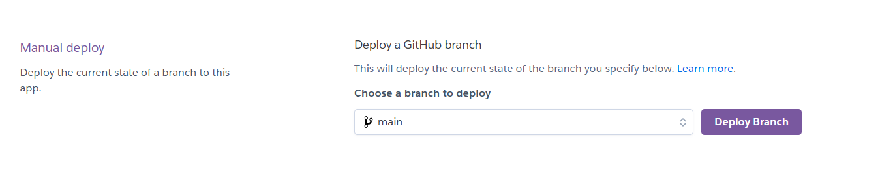
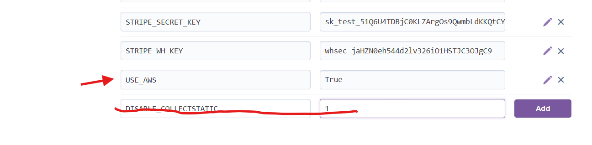

## Deploy your app

Deployment allows you to transfer your project from your local environment to hosting it publicly for other people to view and enjoy.
Make your code repo ready for deployment
This project can be deployed using two different PaaS platforms:

- **Render:** A modern PaaS that offers seamless deployment directly from your GitHub repository.
- **Heroku:** A popular PaaS platform that allows easy deployment of web applications.

For manual deploy in Heroku, you click Deploy Branch 

You can also deploy from terminal in Gitpod with command:
Heroku git push heroku main

#### Heroku
Go to your app, click on activity to check if it has finished deploying
Open app to view the live site.

#### Render
Deploying from Github
Open the app to view live site.

#### Gitpod

In settings:
Set DEBUG = 
False

Make sure everything is migrated.
You can use commands in terminal as:
python3 manage.py showmigrations
python3 manage.py migrate  

Commit and push code to GitHub

Log in to Heroku or Render and check your config vars
If you still have collectstatic, you need to delete that and make sure you use aws.

Any data that you have added to your SQLite database will not transfer to the new one.

