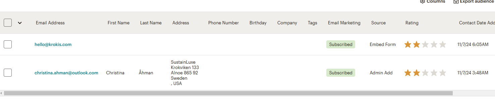

# SEO and marketing research

I started a marketing research and sustainable research for the project.

##  Websites for research:
* https://signofthetimeslondon.com/
* https://www.climatestewards.org/offset/
* https://www.refunder.se/
* https://www.sellpy.se/
* https://us.vestiairecollective.com/
* https://static.schibsted.com/wp-content/uploads/2020/06/04123109/schibsted-adevinta-second-hand-effect-2020.pdf

## Buisness Target Group
Target group for this buisness is
* People with strained finances
* Environmentally concious people
* Fashion-minded people
* Young people 

## Competition 
There is stong competition from fast growing Second Hand stores which invests in app development, International market and easy way to sell.
Big organisation in this market is
-Sellpy
-Vinted
-Thred Up

## SEO Keyword 

SEO is a Search Engine Optimization to optimize websites to rank higher search engine result and drive more traffic to the website.
I used https://www.wordtracker.com/ for SEO

I have a list of key word search:
https://docs.google.com/document/d/e/2PACX-1vQ6sKhLizm5AzfOiwKbFuMO1XqMFbYUj3TAuLa6HcRnzHU45e1Fib74I4NOSbatv46TctD6azuregIm/pub

You can also se SEO rating when testing in Lighthouse.

## Meta tags

I used the keywords in:

<title>Sustainluxe | Luxury Second-Hand Fashion, Climate Smart & Sustainable</title>
<meta name="description" content="Discover Sustainluxe – premium second-hand designer fashion with a climate-smart mission. Shop quality, eco-friendly clothes and make a sustainable impact." />
<meta name="keywords" content="second hand, luxury second hand fashion, online second hand stores, eco-friendly fashion, vintage fashion, sustainable fashion, designer second hand, climate smart fashion, used clothes, quality clothes, carbon saving, footprint, circular fashion, save the world, second hand effect, CO2 savings" />

It is also important to use h1 with high impact keywords, so I added one to Homepage:
<h1 class="text-center">Luxury Second-Hand Fashion for a Sustainable Future at Sustainluxe</h1>

Alt-text to img also affects the SEO
I have named the favicon with secondhandclothes.

## Sitemap

I use a:
- sitemap.xlm
- roboto.txt

These are for collecting the url and which ine shouldn´t be collected.

For the competition market I added:
## Facebook page

You can find this store as an facebook page for more marketing.
You are linkt to the page from footer.

## Newsletter

As a marketing action I provides users with a newsletter from SustainLuxe.
Users are able to subscribe to the newsletter on the website.
I use mailchimp to handle subscribers and newsletter.

When you are logged in at https://us12.admin.mailchimp.com/ you have access to Audience, where you can follow contacts, growth and create segments for example.

From this site, you create your newsletter and make your set ups.

Here is an example of a newsletter to send

![Example newsletter]static/images/Readme_img/example_newsletter.png)

Users can subscribe to newsletter in the footer and after submit, they get a confirmation.

[Back to README.MD](README.md)
