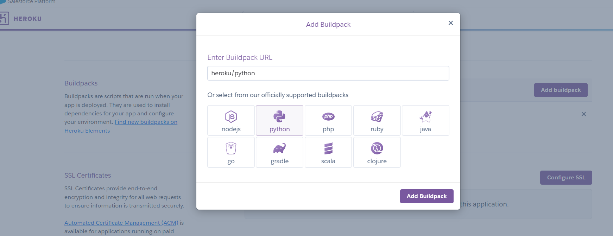

SUSTAINLUXE
by Christina Åhman
Click [hhttps://sustainluxe-b6e840083c68.herokuapp.com] to view the live web application

---

## Repository Git Hub 

1. Create a repository in Git Hub 
2. Create a project and connect it with repository


3. Now you can start add items to your project


####  How to Fork Repository in Git Hub

To fork this repository, click the "Fork" button at the top right corner of the main repository page.
On the "Create a Fork" page, you can change the name of the repo if desired.
Check the box if you want to copy the main branch or multiple branches (main is selected by default). Then, create the fork.

The fork is to change and work with the repository without effecting the original.
You can make a pull request to the original project if you want to implement the changes.

You cant fork your own repository, but you can make <span>clone the repository</span>
You create a copy in your repository (with all files and history). 
This creates a remote link to the original repo, allowing you to work in your copy and push changes back to the original.
To clone it, you open your repo and click the green "Code" button on the right-hand side. The easiest way is to open it with GitHub Desktop.

#### How to Clone (An alternative to fork)

To clone the repository, you create a copy in your repository (with all files and history). This creates a remote link to the original repo, allowing you to work in your copy and push changes back to the original. Open your repo and click the green "Code" button on the right-hand side. The easiest way is to open it with GitHub Desktop.


You can read more information on cloning at the GitHub : https://docs.github.com/en/repositories/creating-and-managing-repositories/cloning-a-repository


## ICE ( Integrated Collaborative Environment )  Gitpod

I choosed Gitpod as a workspace.
You can open Gitpod from your repository.
You will be transfered to Gitpod Dashboard.
Here can you choose which repository you want to work with.


6. I run a backend application in gitpod by typing in terminal:
```
Python3 manage.py runserver
```
7. I migrate my models to database by typing in terminal:
```
pyhton3 manage.py makemigrations
python3 manage.py migrate
```
8. To install the librarys you need, you type in terminal:
``` 
pip install (followed by the the namne of the library)
```
9. You need to install all your librarys in a requirement file:
```
pip freeze > requirements.txt
```

10. You also add your env file:
``` 
import env
```

11. Create an Procfile 
This file is important for deploying to Heroku.

12. You set up a superuser to the database by type in terminal:
```
python3 manage.py createsuperuser
```

13. When adding, deleating or change anything in Gitpod you need to commit to Git Hub.
In terminal:
```
git add .
git commit -m"describe your changes"
git push  
```

## Heroku Setup

1. You set up an new app with the same name as in the repository.


2. Go to settings and click on config vars


3. Add keys to connect with other platsforms: 


2. Create relevant buildpack 




## Database Setup

I choosed PostgreSQL from Code Institute.
I logged in at https://dbs.ci-dbs.net/ 
I received an e-mail with the name of database and added to:
-env.py
-config vars in Heroku


## aws Setup


Sign in to http://aws.amazon.com 

If you dont have an IAM account number, you can use the root sign in.
When you are signed in, you can find your account number to use for IAM


You start to create a bucket - storage service.
This is a cloud storage, where you store img, staticfiles and back up.

You can search for S3 and bucket.
You create a bucket and give it a name.


You can read, edit and upload you files in your bucket.

 

You create users and usergroup to access the bucket in IAM.
From there you can set up policies and access management


Seach for IAM in the searchbox on top:


Here is a link to get a full description of setting up AWS account 
https://docs.google.com/document/d/1bqvCFiCW_JV9sllNZrN5uUJpIiusHICTk4TIk3oUWHY

Here is a link to get full description of setting up IAM:
https://docs.google.com/document/d/1z6L8KKiTi3QU5rMbHXhA3QR9jQIG7wLqnScUDpe238E


You also need to set upp aws in settings: 


## Stripe Payment Setup

1. Register a stripe account at https://dashboard.stripe.com/register.
2. Go to the developers' page:


4. Copy the `public key` and `secret key` to the `env.py` file.

5. Add the following setting to `settings.py`:

```python
  STRIPE_PUBLIC_KEY = os.environ.get("STRIPE_PUBLIC_KEY")
  STRIPE_SECRET_KEY = os.environ.get("STRIPE_SECRET_KEY")
```

6. Install stripe package:

```python
  pip3 install stripe
```

7. Create an order model with the required fields in the check out app.
8. Create a checkout request in views function.
9. Add a payment form to the checkout app
10. Add a webhook handler to receive real time data for callback after payment 

11. Create a View to handle payment setup:
  - Get public key: `stripe_public_key = settings.STRIPE_PUBLIC_KEY`
  - Get private key: `stripe_secret_key = settings.STRIPE_SECRET_KEY`
  - create intent: `intent = stripe.PaymentIntent.create(**kwargs)`

  ```
def checkout(request):
    stripe_public_key = settings.STRIPE_PUBLIC_KEY
    stripe_secret_key = settings.STRIPE_SECRET_KEY

    if request.method == 'POST':
        bag = request.session.get('bag', {})
        order_form = OrderForm(form_data)
        if order_form.is_valid():
            order = order_form.save(commit=False)
            pid = request.POST.get('client_secret').split('_secret')[0]
            order.stripe_pid = pid
            order.original_bag = json.dumps(bag)
            order.save()
    
  and set up an:
  @require_POST
  def cache_checkout_data(request):
```
  This is to prevent CSRF attacks and integrity.

12. Add extra js to integrate with stripe liberary and communicate with stripe
```
  <script>    var stripePublicKey = $('#id_stripe_public_key').text().slice(1, -1);
    var clientSecret = $('#id_client_secret').text().slice(1, -1);
    var stripe = Stripe(stripePublicKey);
    var elements = stripe.elements();
    var style = {
        base: {
            color: '#000',
            fontFamily: '"Helvetica Neue", Helvetica, sans-serif',
            fontSmoothing: 'antialiased',
            fontSize: '16px',
            '::placeholder': {
                color: '#aab7c4'
            }
        },
        invalid: {
            color: '#dc3545',
            iconColor: '#dc3545'
        }
    };
    var card = elements.create('card', {style: style});
    card.mount('#card-element');
  </script>
  ```

    Core logic/payment flow for this comes from here:
    https://stripe.com/docs/payments/accept-a-payment
 
13. The payment intent is created when the user clicks on the confirmation button. 
That stripe element prevents the user from multiple clicks and handles all errors. 
However, you must set alerts for the user to show the error.

14. To test the user's payment, you need to create a test payment intent with the card data provided by the stripe:
  CCVI 4242424242424242

15. Create a function in the checkout views to handle the payment confirmation, which will take payment data.
 This function will also handle email confirmation.

16. Remember to set app stripe data in Heroku configs:

  - Create a webhook in the stripe dashboard and set the hosted endpoint.

  - `STRIPE_PUBLIC_KEY`
  - `STRIPE_SECRET_KEY`
  - `STRIPE_WEBHOOK_SECRET`


